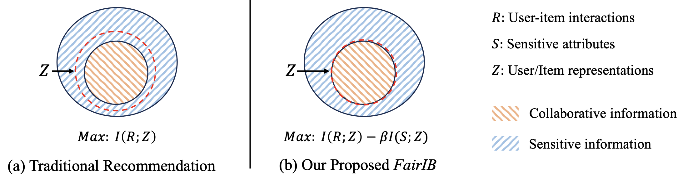

<div align="center">

# [IJCAI 2024] Learning Fair Representations for Recommendation via Information Bottleneck Principle

<p>
Official implementation of "Learning Fair Representations for Recommendation via Information Bottleneck Principle", IJCAI 2024.
</p>


</div>

In this paper, we research fairness-aware recommender systems from the information theory perspective. Motivated by the information bottleneck principle, we propose a novel model-agnostic fair representation method FairIB to eliminate the sensitive information from the learned representations. Specifically, FairIB maximizes the mutual information between learned representations and observed interactions, meanwhile minimizing it between representations and user sensitive attributes. To achieve this goal, we introduce HSIC-based bottleneck to recommender systems, and 
applied to both the user and sub-graph sides. Extensive experiments on two real-world datasets demonstrated FairIB is effective in efficient recommendation accuracy-fairness trade-off, either in single or multiple sensitive scenarios.

Run
--------------
- Training FairIB_BPR on MovieLens: 

```shell
python fairib_bpr_movie.py
```


- Training FairiB_LightGCN on MovieLens: 

```shell
python fairib_gcn_movie.py
```
Author contact:
--------------
Email: jsxie.hfut@gmail.com